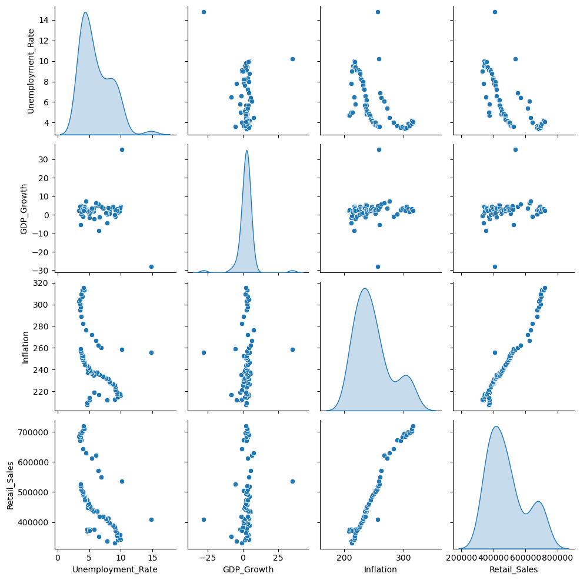
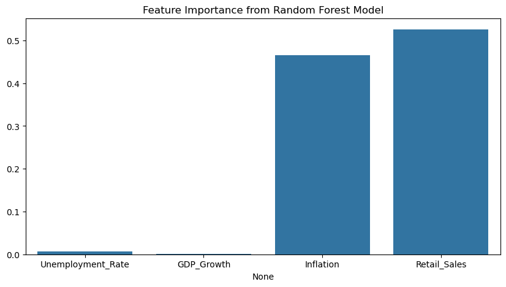
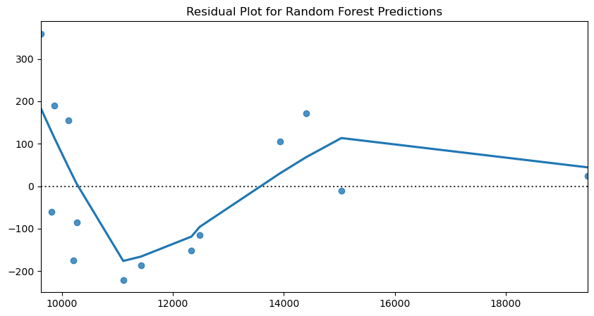

# Unemployment and Economic Indicators Analysis

## Overview

This project conducts an in-depth examination of how changes in unemployment rates influence key economic indicators such as **consumer spending, inflation, and GDP growth**. By leveraging data from the **Federal Reserve Economic Data (FRED)** platform, this analysis employs a combination of **statistical methods, machine learning algorithms, and time series forecasting techniques** to derive actionable insights.

## Dataset

The dataset used in this study is sourced from **FRED**, incorporating a range of macroeconomic indicators, including:

- **Unemployment Rate** (UNRATE)
- **Consumer Spending** (PCE)
- **Inflation** (CPIAUCSL)
- **GDP Growth** (A191RL1Q225SBEA)
- **Personal Consumption Expenditures** (PCEC96)
- **Federal Funds Rate** (FEDFUNDS)
- **Nonfarm Payroll** (PAYEMS)
- **Industrial Production Index** (INDPRO)
- **Retail Sales** (RSAFS)

## Analytical Methodology

### Exploratory Data Analysis (EDA)

- **Correlation Heatmaps**: Identify interdependencies among economic indicators.
- **Pairplots**: Examine variable relationships and detect underlying patterns.
- **Boxplots for Outlier Detection**: Identify and mitigate the impact of extreme values.
- **Time Series Decomposition**: Deconstruct the unemployment rate into trend, seasonal, and residual components.

### Feature Engineering

- **Lag Variables**: Introduced time-dependent relationships by including prior-period values of unemployment and GDP.
- **Rolling Averages**: Smooth fluctuations in inflation and retail sales to improve model performance.

### Machine Learning Models

#### **Regression Models**

- **Linear Regression**: Establishes a baseline predictive model for consumer spending based on macroeconomic indicators.
- **Ridge & Lasso Regression**: Implements regularization techniques to prevent overfitting while maintaining interpretability.
- **Ensemble Learning Methods**:
  - **Bagging**: Uses multiple Linear Regression models to improve generalization.
  - **Random Forest**: Captures nonlinear relationships through multiple decision trees.
  - **AdaBoost**: Enhances predictive accuracy by iteratively focusing on difficult-to-predict instances.

#### **Time Series Forecasting**

- **ARIMA Model**: Predicts unemployment trends using an autoregressive integrated moving average approach.

#### **Clustering & Dimensionality Reduction**

- **Principal Component Analysis (PCA)**: Reduces dimensionality while retaining critical information.
- **K-Means Clustering**: Segments economic activity into distinct clusters for trend analysis.

## Key Findings & Insights

- **Unemployment rates exhibit a strong inverse relationship with consumer spending and GDP growth.**
- **Retail sales and inflation serve as critical leading indicators in economic trend analysis.**
- **Random Forest Regression outperforms other models in predicting consumer spending based on unemployment trends.**
- **ARIMA modeling confirms cyclical trends in unemployment, supporting its use for short-term forecasting.**
- **PCA effectively reduces data complexity while maintaining over 95% variance retention.**
- **Clustering enables segmentation of economic cycles, which can be used for macroeconomic policy planning.**

## Visualization Strategy

### 1. Correlation Heatmap


- Visualizes interdependencies among economic indicators, highlighting strong correlations between inflation, GDP growth, and unemployment.

### 2. Pairplots



- Scatterplot matrix to explore relationships between key economic variables and detect non-linear trends.

### 3. Boxplots for Outlier Detection



- Identifies anomalies in economic indicators, ensuring data quality and consistency.

### 4. Time Series Decomposition


- Decomposes unemployment trends into **trend, seasonality, and residual components** to better understand cyclical movements in the economy.

### 5. Feature Importance Analysis


- Highlights which economic indicators are most influential in predicting consumer spending.

### 6. Regression Residual Plot



- Assesses model accuracy by visualizing prediction errors across different models.

### 7. Clustering Visualization


- Illustrates economic segmentations using **PCA-based clustering**, identifying distinct macroeconomic regimes.

### 8. Subplots for EDA


- Combines multiple analyses into a single figure for improved readability and interpretability.

### 9. Unemployment Forecasting with ARIMA


- Forecasts unemployment trends, demonstrating time series modeling capabilities.

- **Feature Importance Analysis**: Identifies the most influential predictors of economic performance.

- **Residual Plot for Regression Models**: Evaluates model accuracy and potential heteroscedasticity issues.

- **Clustering Visualization**: Provides insight into economic segmentation using PCA-based clustering.

- **Time Series Decomposition**: Showcases underlying patterns in unemployment rate trends.

- **Subplots for EDA**: Combines multiple analyses into a single figure for better interpretability.

## Model Validation & Performance Evaluation

- **Cross-Validation**: Applied to assess model robustness and prevent overfitting.
- **Mean Squared Error (MSE) & R² Scores**: Used to benchmark the accuracy of regression models.
- **Silhouette Score for Clustering**: Evaluates the quality of economic segmentations.

## How to Run the Code

1. Install dependencies:
   ```bash
   pip install pandas numpy matplotlib seaborn scikit-learn statsmodels
   ```
2. Run the Jupyter Notebook or Python script.
3. View model results and visualizations.

## Repository Structure

```
├── expanded_economic_data.csv  # Dataset
├── unemployment_analysis.ipynb  # Jupyter Notebook with analysis
├── README.md  # Project documentation
```

## Future Enhancements

- **Apply Deep Learning techniques such as LSTMs for long-term economic forecasting.**
- **Integrate additional economic indicators such as interest rate spreads and consumer confidence indices.**
- **Develop an interactive dashboard for real-time economic monitoring.**

